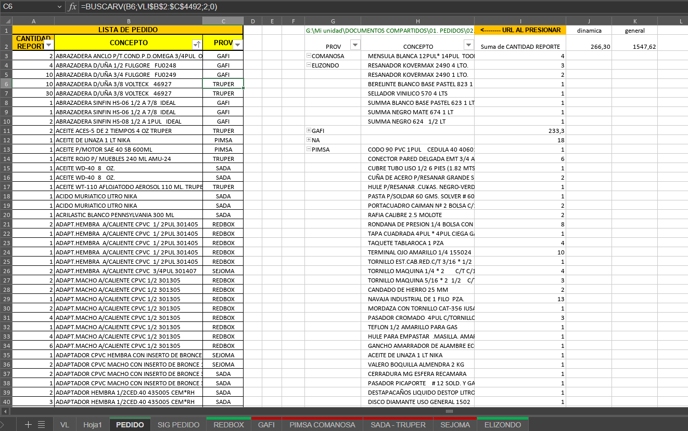
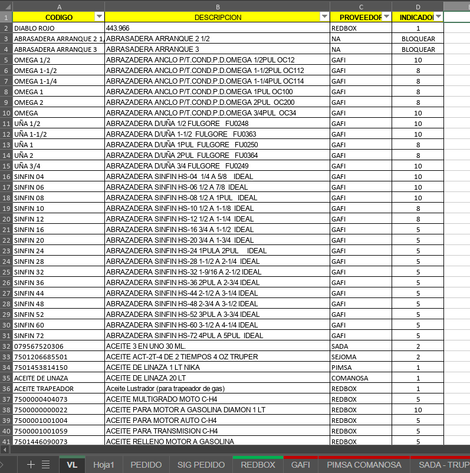

# Pedidos-automatizados
Este proyecto simula un sistema de generación y control de pedidos desarrollado con Microsoft Excel. Utiliza fórmulas, validaciones y tablas dinámicas para automatizar el flujo de trabajo de una ferretería.

## Funcionalidades

- Selección de productos
- Control de stock e inventario
- Generación automática de pedidos
- Reportes resumidos mediante tablas dinámicas

## Herramientas usadas

- Microsoft Excel
- Fórmulas condicionales
- Tablas dinámicas
- Validación de datos

## Capturas del sistema

### Tabla dinámica de pedidos
Se extrae la información de un archivo que nos arroja nuestro sistema de punto de venta, el cual se descarga en una carpeta, misma que está vinculada con su ruta al archivo de excel, 
se extraen los valores de Cantidad vendida + Descricpción del producto (lado izquierdo) y se relaciona con su respectivo proveedor (formula superior) gracias la información extraida de la tabla VL (lo veremos más adelante)
y con una tabla dinámica se suman cantidades y se unifican descripciones y proveedores (lado derecho)  

 
### Validaciones de datos
Se tiene alimentada una hoja de validación (VL) en donde previamente junto con el equipo de Redbox, se determinó la cantidad mínima a tener en stock (por semana) para cada producto, y con ello tener de manera automatizada que productos son necesitados de surtir y cuales pueden esperar a una siguiente ronda.

### Pedido Listo
Se separa por hojas a los diferentes proveedores para tener los reportes por separado de cada uno de los pedidos, así como la extracción simplificada de información para que el usuario final pueda extraer el pedido listo y compartirlo con el proveedor correspondiente
Este ultimo paso no se realiza de manera automatizada, ya que por petición de el cliente, se requería una ultima validación por parte del usuario final, adicional de agregar algunos productos por pedidos adicionales o escenarios relacionados
Agregando tambien que la relación con cada proveedor podía cambiar en cada semana, aún así, lo que si fue posible automatizar reduce actualmente un tiempo significativo a los usuarios finales quienes pueden aprovechar los recursos optimizados
Y reduciendo el margen de error a pedidos por debajo del stock recomendado o bajo el mismo.

## 🛠️ Funcionalidades

- Selección automatizada de productos
- Cálculo automático de totales
- Control de stock
- Análisis con tablas dinámicas
